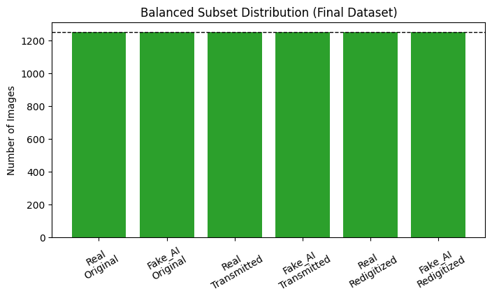
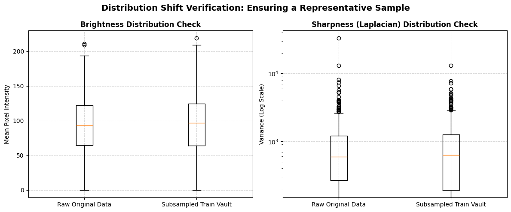
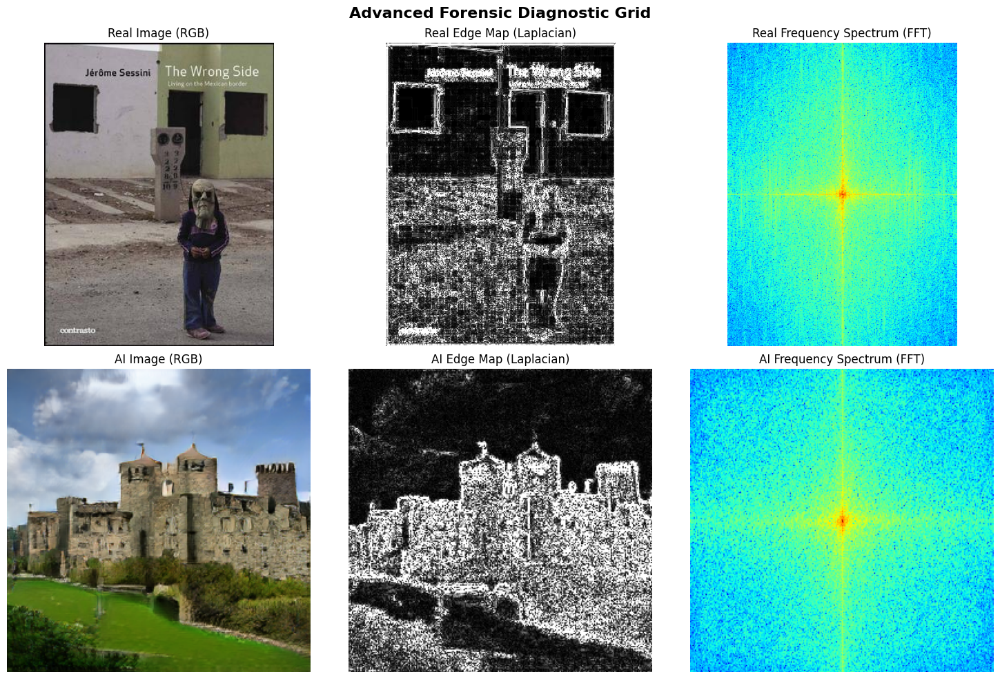

# Project 2 — Joint Detection of AI-Generated Images and Post-Processing Alterations

> **Course:** Computer Vision · 2025–26  
> **Task:** Given a single input image, simultaneously predict (1) whether it is a real photograph or AI-generated, and (2) which post-processing transformation has been applied to it.

---

## Authors & Institutional Context

This project was developed cooperatively as part of the Erasmus+ Exchange Program at **Sapienza Università di Roma**.

* **Alberto Rivas** —  Polytechnic University of Oviedo / Uniovi
* **Carlos Fernández** —  Polytechnic University of Oviedo / Uniovi
* **Joaquín Avilés** — University of Granada / UGR

---

---

## Repository Structure

```
├── code.ipynb                  # Full pipeline: data → model → training → evaluation
├── Dataset/                    # See link below — too large for Git
├── Project_Presentation/       # Slides
├── README.md
└── Figures                     # Contains the Figures for this readme
```

## Dataset

The project uses the **RRDataset** — a real-world robustness benchmark containing real photographs and AI-generated images across three post-processing splits: **Original**, **Internet-Transmitted**, and **Re-digitized**.

> **Dataset download:** [https://drive.google.com/drive/folders/1CzWAxIhxyBlK4XRAYrQrbexKosUDD1yP?usp=drive_link]

The dataset is not included in this repository due to its size. After downloading, place it at the path defined in the `BASE_DATA_PATH` global (see section 2 Globals).

---

## Requirements

```bash
torch torchvision
opencv-python
Pillow
numpy
matplotlib
pandas
scikit-learn
```

All code is designed to run on **Google Colab** with a GPU runtime. Mount your Google Drive before executing any cell.

---

## How to Run

1. **Environment Setup:** Mount Google Drive and verify that `BASE_DATA_PATH` and `MODEL_SAVE_DIR` point correctly to your target directory paths.
2. **Commented Code & Execution Avoidance:** Multiple sections of the notebook are commented out by default because they do not need to be re-run:
   * **Data Pipeline:** Cells managing dataset downloading, balanced downsampling, and partitioning are locked. **It is not necessary to uncomment or run these cells** if you use the pre-processed, structured dataset provided in the **Dataset** section link.
   * **Network Architecture:** The model section contains commented-out code from a preliminary exploratory experiment used to evaluate alternative backbones. **It is not necessary to re-run this exploration**, as the notebook is pre-configured to execute end-to-end using the final selected **ConvNeXt-Tiny** architecture.
3. **Pipeline Execution:** Run remaining active cells sequentially from top to bottom (**Runtime → Run all**).
4. **Hyperparameter Sweeps:** To transition between experiments (e.g., changing baselines or running the ablation sweep), update only the `ALPHA` variable in the Globals section and execute from the training initialization cells onward.

> ⚠️ **State Constraint:** Avoid executing cells out of order. The custom `Dataset` object caches its internal image-to-target path mapping at initialization (`__init__`). If folders or geometric transforms are modified, you must re-run both the Dataset initialization and the downstream `DataLoader` cells to re-collate active memory batches.
---

## Code Walkthrough

### 1. Imports

The import block establishes the functional dependency layers required to support the execution lifecycle:

* **Deep Learning Engine (PyTorch):** Powers the core tensor mechanics. `torch.nn` designs the dual-head multi-task architecture, `torchvision` pulls the pre-trained ConvNeXt weights, and **AdamW** separates weight decay from adaptive gradient updates to optimize fine-tuning precision.
* **Image Processing Engine (PIL & OpenCV):** Split by operation type. PIL manages downstream data-loader batch ingestion, while OpenCV supplies high-precision floating-point matrix control for advanced forensic features (Laplacian edge maps, DoG, and 2D FFT spectra).
* **Metrics Core (scikit-learn):** Handles completely isolated post-hoc evaluation tools to keep external statistical estimators out of the PyTorch `autograd` graph.
* **Pipeline Configuration:** Overrides PIL thresholds (`Image.MAX_IMAGE_PIXELS = None`) to unlock seamless background decoding for high-resolution research imagery.

---

### 2. Globals

```python
# Hardware routing
DEVICE = torch.device("cuda" if torch.cuda.is_available() else "cpu")

# Paths
BASE_DATA_PATH = "/content/drive/MyDrive/CV_project/CV_Project_data/RRDataset_PyTorch_Ready"
MODEL_SAVE_DIR = "/content/drive/MyDrive/CV_project/CV_Project_models"

# Hyperparameters
CROP_SIZE      = 224
BATCH_SIZE     = 32
LEARNING_RATE  = 1e-4
EPOCHS         = 20
```

Centralizing all mutable configuration parameters in a single block ensures notebook-wide consistency, eliminating the risk of parameter mismatch between training, evaluation, and checkpointing.

* **`CROP_SIZE = 224`:** Matches the input dimensions required by pre-trained ConvNeXt-Tiny weights. Because the backbone's patchify stem relies on fixed 4×4 non-overlapping patches, deviating from 224×224 would disrupt positional embedding expectations and degrade features.
* **`BATCH_SIZE = 32`:** Balances GPU memory consumption, computational throughput, and gradient variance. It provides stable optimization path convergence during fine-tuning.
* **`LEARNING_RATE = 1e-4`:** Sets the baseline learning rate for the new classification heads. The backbone uses a differential learning rate scale factor ($0.1 \times \text{LR} = 10^{-5}$) to protect pre-trained ImageNet representations from catastrophic forgetting while allowing the heads to learn rapidly.
* **`EPOCHS = 20`:** Selected empirically based on baseline convergence trends (where metrics stabilized between epochs 7 and 15), providing sufficient headroom for slower multi-task adjustments without wasting compute.

---

### 3. Utilities 

To keep the main training lifecycle clean and modular, several specialized helper functions are predefined at this stage. These functions decouple visualization and pre-training exploratory data analysis (EDA) from the structural network cells.

### 2.1 Model Metrics Visualization
* **`plot_training_history`:** Tracks and renders comparative training vs. validation loss trends across optimization epochs to monitor for potential overfitting.

### 2.2 Pre-Training Forensic Descriptors
The following utility functions extract classical computer vision features to analyze structural differences between natural and AI-generated imagery:
* **`extract_course_features`:** A modular feature extractor that isolates distinct structural signatures from a single image path:
  * **Local Contrast (CLAHE):** Highlights localized micro-texture irregularities.
  * **Scale Space (DoG):** Functions as a spatial bandpass filter to detect artifacts from neural upsampling.
  * **Gradient Histograms (HOG Angles):** Maps structural edge orientation fields.
  * **Keypoint Tracking (ORB):** Counts and evaluates local scale-invariant corner point density.
* **`run_syllabus_eda_comparison`:** Compiles the extracted features into a side-by-side $2 \times 4$ diagnostic matrix for direct comparative validation.
* **`plot_advanced_forensics`:** Maps spatial gradients against the frequency domain via **Laplacian Edge Maps** (second spatial derivatives) and **2D Fast Fourier Transform (FFT) Magnitude Spectra** to expose generative checkerboard anomalies.
---

### 4. Data

Before detailing the pipeline execution, it is necessary to establish the directory structure of the project. The data repository is organized into distinct workspace environments to isolate source assets, balanced subsets, and experimental checkpoints:

* **`RRDataset_original_train_val` & `RRDataset_final`:** The raw, uncurated source repositories containing the complete, unbalanced multi-task image distributions.
* **`RRDataset_Balanced_Subset`:** The unified target repository containing the balanced downsampled collection ($7,500$ images total) prior to partitioning.
* **`RRDataset_PyTorch_Ready`:** The final production environment containing the isolated, stratified `train / val / test` data splits ready for DataLoader streaming.
* **`RRDataset_preprocessing`:** A mirror backup copy of the `RRDataset_PyTorch_Ready` environment to preserve data integrity for possible changes in the original(no more than security).
* **`RRDataset_Mini_Subset`:** A lightweight, downscaled version of the dataset used exclusively for the quick empirical network tests during the model selection phase.

### 4.1 Dataset Profiling & Imbalance Resolution

The raw dataset contains an asymmetrical distribution across its transformation layers, which introduces optimization challenges that are resolved prior to building the network pipeline.

* **Raw Imbalance Discovery:** Profiling the source distribution reveals a structural bottleneck: the "Original" transformation category caps out at exactly 1,250 images per class, whereas "Transmitted" and "Redigitized" variants contain roughly 8,500 images each, totaling 36,499 raw images. 
* **Hardware & Runtime Constraints:** Execution is bounded by a shared **Google Colab T4 GPU** environment. The project requires training 7 separate configurations (2 unimodal baselines, 1 joint model, and 4 ablation sweeps) running at roughly 1 hour per model. Training on the uncurated 36.5k image pool would cause compute-quota exhaustion and immense training stalls.
* **Algorithmic Downsampling:** To satisfy the rubric's class-balance criteria and accommodate hardware limitations, a deterministic subsampling strategy is applied. Using a fixed random initialization seed (`seed(42)`), `random.sample` extracts a uniform subset matched to the lowest common denominator: 1,250 images per distinct sub-category.
* **Mathematical Balance Verification:** The resulting subset scales down to a perfectly balanced pool of exactly 7,500 total images. This complete balance across both Authenticity (Real vs. Fake) and Transformation splits prevents the network from developing majority-class prediction biases (such as blindly outputting "Transmitted"), ensuring that accuracy values accurately reflect learned forensic artifacts.



### 4.2 Stratified Partitioning & Vault Isolation

To prevent overfitting and secure an unbiased final validation protocol, the 7,500 balanced image pool is divided into three strictly isolated sets using a custom nested partition strategy.

* **Split Distribution:** The dataset is split into an **80% Training Set (6,000 images)**, a **10% Validation Set (750 images)**, and a **10% Test Set (750 images)**. The Test Set remains completely locked during training and hyperparameter tuning, serving as the final evaluation benchmark.
* **Multi-Task Stratification:** Splitting is applied uniformly across the combined multi-task label boundary (`Authenticity + Transformation`). This strict stratification guarantees that each distinct subset retains a perfect uniform distribution (1,000 images per class in Train, 125 images per class in Val, and 125 images per class in Test).


### 4.3 Training Set Profiling & Leakage-Free Diagnostics

Statistical feature analysis is performed exclusively on the isolated Training set. This acts as a representative proxy for the dataset without inducing data leakage into the validation or testing pipelines.

* **Forensic Metrics Discovered:** Comparing 500 sampled Real vs. AI images inside the `Original` category revealed distinct mathematical boundaries:
  * **Brightness & Contrast:** AI images exhibit higher average pixel intensity ($+0.0647$) and wider variance ($+0.0603$) than natural images.
  * **Sharpness (Laplacian Variance):** AI images are significantly sharper than real camera images, yielding a higher Laplacian variance ($+200.94$). This indicates the presence of crisp, artificial high-frequency textures or edge profiles characteristic of generative models.
* **Distribution Shift Verification:** Comparative boxplots mapping raw data against the subsampled training vault confirm overlapping distributions across brightness and sharpness domains. This statistical match verifies that downsampling preserved the natural feature distributions of the source data.



#### 4.3.1 Statistical Distribution Shift Verification

To confirm that our algorithmic downsampling did not introduce selection bias or alter the underlying feature distributions of the dataset, a comparative statistical analysis was performed between the full **Raw Original Data** and the **Subsampled Train Vault**. 

* **Brightness Distribution Parity:** The mean pixel intensity distributions are virtually identical. The medians ($\approx 95$), interquartile ranges (IQR, spanning $\approx 65$ to $125$), and full range bounds show near-perfect structural alignment. This confirms that downsampling did not skew the dataset towards abnormally dark or bright subsets.
* **Sharpness (Laplacian Variance) Fidelity:** Measured on a log scale due to extreme structural outliers, the second-order gradient distributions remain highly consistent between both pools. The median variance ($\approx 600$) and the heavy-tailed outlier profiles track each other seamlessly. This ensures that high-frequency structural traits, such as sensor noise and sharp edges, were completely preserved.
* **Pipeline Validation:** The overlapping morphology of these boxplots mathematically proves that the random sampling strategy successfully maintained the statistical characteristics of the source data. The Subsampled Train Vault serves as a reliable, statistically uncorrupted proxy for wide-scale model optimization.

### 4.4 Advanced Forensic Pixel & Frequency Analysis (EDA)

To expand the exploratory analysis beyond baseline statistics, classical feature extraction methods were applied to single-image samples from the Training set. This evaluation analyzes how spatial variations, gradient fields, and 2D frequency spectra expose distinct structural anomalies in AI-generated content compared to real photographs.

#### 4.4.1 Frequency and Sharpness Domain Diagnostics

By passing the sample files through the `plot_advanced_forensics` engine, spatial intensity changes were isolated using second spatial derivatives (Laplacian maps) alongside global frequency profiles (2D FFT Magnitude Spectra).



* **2D FFT Spectrum & Noise Dispersion:**
  * **Real Photo Spectrum:** The magnitude spectrum shows a clean, traditional concentration of energy clustered tightly around the low-frequency center axis. The amplitude signals decay smoothly and predictably as they move toward the outer bounds, carrying minimal high-frequency noise.
  * **AI-Generated Image Spectrum:** The synthetic spectrum displays an anomalous spread of high-amplitude noise pushed far out toward the outer vertical and horizontal high-frequency edges. This characteristic footprint stems directly from upsampling and deconvolution operations inside generative neural networks, which inject repeating high-frequency structural noise artifacts into the pixel matrix.
* **Laplacian Edge Maps & Textural Fidelity:**
  * **Real Photo Laplacian:** The second-order gradient map captures significantly less fine structural detail across subtle variations in the human subject. Because the natural camera sensor is constrained by physical lens properties and soft low-frequency transitions, micro-details (such as the facial structure under the mask) appear darker and less sharply defined.
  * **AI-Generated Laplacian:** The synthetic edge map exhibits an unnaturally hyper-sharp, uniform response. It easily captures sharp high-frequency elements across the entire canvas—ranging from deep texture variations in the brickwork to the fine geometric structures of the castle windows and towers. This mathematical sharpness confirms that generative models optimize heavily for micro-level edge contrast, leaving behind a clear forensic trail.

### 4.5 Forensic-Optimized Image Preprocessing Pipeline

Instead of relying on standard augmentation defaults, we designed a targeted preprocessing pipeline. While it uses standard cropping to unify spatial dimensions, specific high-fidelity adjustments were made to protect microscopic forensic traces:

* **Nearest-Neighbor Interpolation:** Standard resampling (like bilinear or bicubic) acts as a low-pass filter, essentially smoothing away the exact micro-anomalies we want to detect. We enforce Nearest-Neighbor scaling to preserve discrete 8×8 JPEG compression blocks and artificial generative checkerboard footprints.
* **Coherent Spatial Constraints:** We allow horizontal flips but strictly forbid vertical flips or arbitrary rotations. This protects the physical coordinate rules of "Redigitized" screen captures, where moiré interference waves and overhead ambient glare depend on a consistent top-to-bottom orientation.
* **Anti-Shortcut Regularization (Random Erasing):** Multi-task networks are prone to "shortcut learning"—memorizing a single local artifact to lazily guess both labels. By randomly occluding small spatial sub-regions, we force the network's attention to distribute uniformly across the entire canvas.
* **Luminance & Color Jittering:** Subtle color and grayscale shifts prevent the model from memorizing the global chromatic signatures of specific cameras or generative rendering engines.


### 4.6 Custom Multi-Task Learning Dataset Architecture

Standard PyTorch dataloaders (like `ImageFolder`) are hardcoded for single-label classification. Because our architecture requires a unified backbone to predict two independent forensic traits simultaneously, we engineered a custom multi-task dataset wrapper.

* **Dynamic Path Crawling:** The dataset automatically crawls our nested directory structure, decoding the physical path of each image to dynamically identify its ground-truth categories.
* **Synchronized Integer Mapping:** It converts the text-based metadata into discrete numerical tokens required for PyTorch's Cross-Entropy Loss optimization:
  * **Task 1 (Authenticity):** `Real` $\rightarrow$ 0 | `Fake_AI` $\rightarrow$ 1
  * **Task 2 (Transformation):** `Original` $\rightarrow$ 0 | `Transmitted` $\rightarrow$ 1 | `Redigitized` $\rightarrow$ 2
* **Multi-Target Output:** Instead of returning a standard `(image, label)` pair, the custom pipeline processes the raw image through the forensic augmentations and streams a structural multi-target tuple: `(image_tensor, authenticity_label, transformation_label)`.

### 4.7 Parallelized Batch Streaming Engines (DataLoaders)

Once the data is mapped and preprocessed by the custom dataset class, it must be efficiently streamed from the storage disk into active GPU memory. We initialized PyTorch `DataLoader` pipelines to handle this transition systematically.

* **Batch Optimization:** We utilize a mini-batch size of 32. This specific threshold maximizes the statistical stability of our stochastic gradient descent (SGD) updates while safely operating within the tight VRAM limits of the Google Colab NVIDIA T4 GPU.
* **Stochastic Shuffling:** Shuffling is strictly enabled for the training partition. This exposes the network to an unpredictable, randomized distribution of classes across iterations, preventing it from developing temporal sequence biases. The validation and test vaults remain unshuffled to guarantee deterministic, reproducible evaluations.
* **Hardware Acceleration:** To prevent the GPU from idling while waiting for images to load, the pipeline employs parallel CPU multi-threading (`num_workers=2`). Additionally, we enable page-locked memory (`pin_memory=True`), which significantly accelerates the transfer speeds of tensor batches directly into the CUDA hardware architecture.

## 5. Network Architecture

The objective of our architecture is to implement a **Multi-Task Learning (MTL)** network that processes a single input image to simultaneously solve two independent forensic tasks:
1. **Authenticity Classification** (Real vs. Fake).
2. **Post-Processing Transformation Identification** (Original vs. Internet-Transmitted vs. Re-digitized).

To prevent feature degradation across tasks, the network utilizes a **shared-backbone schema**. A single feature extractor isolates low-level forensic artifacts (such as generative checkerboard anomalies and high-frequency noise) and routes the resulting latent embedding into two parallel, independent classification heads.

### 5.1 Backbone Exploratory Selection & Paradigm Comparison

Before finalizing the pipeline architecture, a preliminary empirical exploration was executed on the lightweight `RRDataset_Mini_Subset` to benchmark three distinct generations of Computer Vision backbones under a single-task baseline (Authenticity detection):

* **ResNet-50 (Residual Convolutional Paradigm):** Acted as our traditional baseline. Although robust due to its residual connections, its reliance on successional pooling and small $3\times3$ kernels aggressively downscales spatial resolution, which tends to smooth away subtle high-frequency forensic signatures.
* **EfficientNet-B3 (Compound Scaling Paradigm):** Evaluated due to its optimized resource efficiency via mobile inverted bottlenecks ($MBConv$). However, its architectural tuning prioritizes global semantic object features over the localized pixel-level anomalies crucial for synthetic image detection.
* **ConvNeXt-Tiny (Modernized Convolutional Paradigm):** Selected as our final production backbone. Designed as a pure convolutional network that emulates the representation strengths of Vision Transformers (ViTs), it introduces a non-overlapping **Patchify Stem** ($4\times4$ patches) and larger $7\times7$ convolutions. This layout expands its early effective receptive field, enabling the network to capture periodic grid structures and edge profiles simultaneously.

### 5.1.1 Prototype Generation Strategy (Lightweight Subsampling)

Before execution of the full backbone selection matrix, the pipeline initializes a localized, resource-optimized exploratory environment. This sandbox architecture relies on the algorithmic isolation of a lightweight and perfectly balanced prototype subset extracted from the raw data pools. 

The conceptual methodology behind this tactical downsampling is governed by three primary engineering objectives:

* **Compute-Quota Mitigation:** Training multiple deep neural networks across the entire 36.5k uncurated image pool during a preliminary exploratory phase would trigger Google Colab T4 runtime exhaustion and introduce immense training stalls. The prototype engine acts as a fast-forward validator to optimize computational throughput.
* **Stochastic Parity Insurance:** The system enforces an absolute equilibrium constraint by pulling exactly 300 randomized samples for every discrete multi-task label pairing. This strict balance guarantees a level playing field, preventing competing architectures from developing majority-class statistical biases toward uncurated data trends.
* **Deterministic Isolation:** By locking a fixed random initialization seed during the slicing routine, this prototype vault functions as a scientific control baseline. This guarantees complete experiment reproducibility, ensuring that any performance variations recorded across the backbones are mathematically driven by their structural layers rather than random distribution shifts.

### 5.1.2 Exploratory Preprocessing Engine & Normalization Baseline

To evaluate the pre-trained features of ResNet-50, EfficientNet-B3, and ConvNeXt-Tiny under identical conditions, the prototype pipeline establishes a rigorous data normalization baseline.

#### **The Methodology: Why and How**
* **The "Why":** Neural networks pre-trained on ImageNet-1K expect input data to match the exact statistical distribution of the original training corpus. Deviating from these channels changes the activation distribution inside the initial convolutional layers, leading to unrepresentative performance metrics that disrupt the backbone selection process.
* **The "How":** The pipeline compiles standard geometric and tensor operations into fixed sequential chains. Crucially, for this comparative diagnostic, the prototype bypasses stochastic data augmentations (such as random cropping or complex erasing). By freezing spatial configurations via deterministic transformations, the network architectures are forced to compete purely on their internal feature-extraction capacity, filtering out any performance gains caused by random augmentation luck.

#### **Conceptual Pipeline Stages**

1. **Spatial Dimension Unification:** Every image enters a deterministic resizing stage to establish a uniform grid layout. This step is mandatory because the final downstream classification heads expect a fixed-size latent representation vector from the backbone.
2. **Data Structure Casting:** The pixel matrices are transformed from standard 8-bit integer formats into multi-dimensional floating-point tensors. This operation scales the intensity values into a continuous range, which is the mathematically required format for gradient propagation in PyTorch.
3. **Statistical Channel Standardization:** Each color channel (Red, Green, Blue) undergoes a shift-and-scale transformation to match the exact mean and standard deviation profiles of the ImageNet dataset. This centers the data distribution, ensuring that the pre-trained convolutional filters operate at peak efficiency from the very first iteration of the benchmark test.
